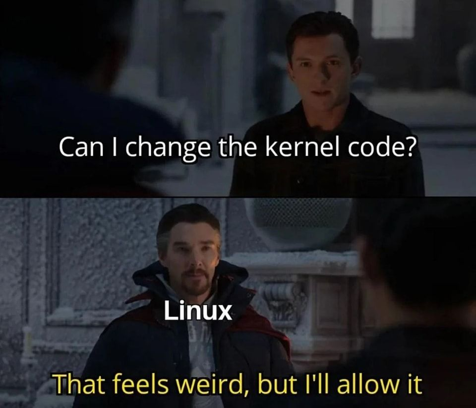
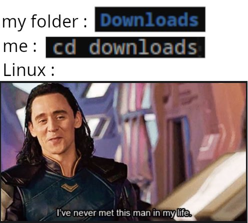
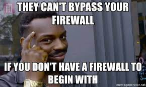

# [Getting Started with Linux](../Resources/Docs/Ubuntu%20Server%20CLi%20cheat%20sheet%202024%20v6.pdf)

&nbsp;

## Help!?

```shell
command --help
```

&nbsp;

## Manuals (Help, man.)

```shell
man command
```

&nbsp;

## Terminal

- Get shit done without any bs.
- `CTRL + D` or, `exit` to escape anytime.)

&nbsp;

## Shells

- Works between the terminal and the OS's kernel (like an APi to the kernel)
- Bourne Again Shell ( bash )
- powershell ( pwsh )
- [zsh](https://ohmyz.sh)
- fish
- C Shell ( csh )

&nbsp;



&nbsp;

## File System Navigation

### List items

```shell
ls
```

Optional tags

`-l` `-al`

### Print working directory

```shell
pwd
```

### `NOTES`

- `case-sensitive`

- use `TAB`

### Change Directory

```shell
cd Downloads
```

&nbsp;



&nbsp;

### Go back

```shell
cd ..
```

### Hop between path/directories

```shell
cd -
```

### Go home

```shell
cd
```

Or,

```shell
cd ~
```

&nbsp;

## Working with Files & Directories

### Create a file

```shell
touch filename.extension
```

### Create a Directory

```shell
mkdir directory-name
```

### Multiple directories

```shell
mkdir directory1 directory2 directory3
```

### Nested directories

```bash
mkdir someDir/oneDir/anotherDir -p
```

### Show file contents

```shell
cat filename.extension
```

### With index

```shell
cat -n filename
```

### Write & Save

```shell
echo "Write something here" > filename.extension
```

### Write & Save to an _existing file_

```shell
echo "Write something here" >> filename.extension
```

### Move file

```shell
mv this_file.extension to-this-directory
```

### Move Directory

```shell
mv move-this-directory to-this-directory
```

### Copy file's contents to another file

```shell
cp this_file.extension to_this_file.extension
```

### Copy file's contents to another Directory's File

```shell
cp this_file.extension to-this-directory/then_to_this_file.extension
```

### Remove a file

```shell
rm filename.extension
```

### Remove a Directory

```shell
rm -r directory-name
```

&nbsp;

## **Remove Everything** (_recursively_!)

- `Be careful` while using this one!

- Never run this command on `root` ( / ) or, it'll destroy the entire operating system!

```shell
rm -r *
```

&nbsp;

## Nano

```shell
nano filename.extension
```

- Edit file, if it's not found, it creates a new file
- Write & CTRL + O, to write out & press enter to confirm
- CTRL + X, exit nano...

&nbsp;

## Vim

While at it, use _neovim_ instead.

```shell
vim filename.extension
```

```shell
nvim filename.extension
```

- press `i` to insert & write...

- `ESC` to exit insert mode

- `:wq` to Write & Quit

- `:q` to Quit

&nbsp;


&nbsp;

## Network Management

- press `q` to quit or, `CTRL + C` to cancel.

&nbsp;

## Status

```shell
networkctl status
```

&nbsp;

## iP & MAC

- Requires `net-tools`

```shell
ifconfig
```

```shell
networkctl status
```

```shell
ip route
```

&nbsp;

## Firewall

- **ufw**

### Enable

```shell
sudo ufw enable
```

### Status

```shell
sudo ufw status
```

### Permissions

```shell
sudo ufw allow port_number
```

&nbsp;



&nbsp;

## SSH

- Connect to a system/server through `ssh`

- Replace `192.168.0.103` with your `Server's iP`

&nbsp;

```shell
ssh username@your_server_ip
```

### Like this:

```shell
ssh sam@192.168.0.103
```

&nbsp;

- Allow SSH's port `22` to start listening for incoming connections

- if you're using a firewall that is, `ufw`

&nbsp;

```shell
sudo ufw allow 22
```

&nbsp;

## APT: The Package Manager

- _Debian/Ubuntu_ Systems

### Search

```shell
apt search package-name
```

### install

```shell
sudo apt install package-name
```

### Remove

```shell
sudo apt remove package-name
```

### Remove _unnecessary/cached_ packages

```shell
sudo apt autoremove
```

&nbsp;

## Some useful _packages_

- htop

- bpytop

- neofetch

- screenfetch

- vim

- git

- espeak

- figlet

- curl

- wget

- tree

- mlocate

- terminator

- vlc

- python3

- python3-pip

- python3-pyaudio

- postgresql

- nodejs

- net-tools

- ufw

- ssh

- tor

- proxychains

- wireshark

- gnome-clocks

- gnome-todo

- gnome-tweaks

- thunar

- dolphin

- libreoffice

- gimp

- android-tools-adb

- android-tools-fastboot

- sl (Train Animation\*)

- docker

&nbsp;

## install a snap package

- `snap`: Ubuntu's package manager

&nbsp;

```shell
sudo snap install package-name
```

### _--classic_ \*if required

```shell
sudo snap install package-name --classic
```

### Changes

```shell
snap changes package-name
```

```shell
snap changes nextcloud
```

### info

```shell
snap info package-name
```

```shell
snap info nextcloud
```

### Connections

```shell
snap connections package-name
```

```shell
snap connections nextcloud
```

### Remove a snap

```shell
sudo snap remove package-name
```

&nbsp;

## Some useful _snap-packages_

- code (VS Code)

- spotify (_--classic_)

- postman

- chromium

- firefox

- nextcloud

- pycharm

- microk8s

&nbsp;

## install a `.deb` package

- For _Debian/Ubuntu_ systems

&nbsp;

### `executable` permission!

```shell
chmod +x package-name
```

### install the package

```shell
sudo apt install ../Resources/memes/package-name.deb
```

&nbsp;

## `pacman`: The Arch Package Manager

- _Arch_ based systems

- _AUR_, another way to install packages on Arch based systems

&nbsp;


### Update & Upgrade

```shell
sudo pacman -Syu
```

### install an arch package

```shell
sudo pacman -Sy package-name
```

```shell
sudo pacman -S package-name
```

### Remove an arch package

```shell
sudo pacman -R package-name
```

### Remove a package along with its dependencies

```shell
sudo pacman -Rs package-name
```

&nbsp;

## `DNF`: The Fedora Package Manager

- _Fedora_ based systems ( Red Hat, RHEL )

- Successor to _YUM_

&nbsp;

## Update & Upgrade fedora

```shell
sudo dnf update
```

```shell
sudo dnf upgrade
```

### Search a package

```shell
dnf search package-name
```

### install a package

```shell
sudo dnf install package-name
```

### Remove a package

```shell
sudo dnf remove package-name
```

### Clear package cache

```shell
sudo dnf autoremove
```

&nbsp;

## installing a `.rpm` package

- Fedora/RHEL Systems

&nbsp;

### \*Executable permissions

```shell
chmod +x package-name
```

### installation

```shell
sudo dnf install ../Resources/memes/package-name.rpm
```

&nbsp;

## System Management

### Date & Time

```shell
date
```

### Uptime

```shell
uptime
```

### Reboot

```shell
reboot
```

```shell
sudo reboot
```

### Shutdown/poweroff

```shell
poweroff
```

```shell
sudo poweroff
```

&nbsp;

## Run the previous command w/ _superuser_

```shell
sudo !!
```

Or, use `the-fuck` package.)

&nbsp;

## Update

```shell
sudo apt update
```

&nbsp;

## Upgrade

```shell
sudo apt upgrade
```

&nbsp;

## Update & Upgrade System

- `-y` for auto-confirmation

&nbsp;

```shell
sudo apt update && sudo apt upgrade
```

```shell
sudo apt update ; sudo apt upgrade -y
```

&nbsp;

## Switch to `superuser`

```shell
sudo su
```

&nbsp;


&nbsp;

## System Status

- press `q` to quit

```shell
systemctl status
```

&nbsp;

## Date-Time

```shell
timedatectl status
```

&nbsp;

## System info

```shell
uname -a
```

&nbsp;

## Disks

- Use `Disks` application for disk management ( GUi )

&nbsp;

```shell
df -h
```

```shell
lsblk
```

`Note`: Choose the disk's name carefully!

### Mount

```shell
sudo mkdir /mnt/external
```

```shell
sudo mount /dev/sdX1 /mnt/external
```

### Navigate to the disk

```shell
cd /mnt/external
```

### Unmount the disk

```shell
umount /mnt/external
```

### Auto-Mount Functionality\*

- Replace `ext4` with your disk format like... `ntfs` `btrfs` `exfat` `fat32` in the following...

```shell
sudo vim /etc/fstab
```

### Write the follwing inside the file

```shell
/dev/sdX1 /mnt/external ext4 defaults 0 0
```

### More `Notes`

- Use `TAB` for auto-completion

- press `CTRL + C` to cancel an ongoing operation

- `CTRL + D` to quit

- `CTRL + SHiFT + C` to copy something from the terminal

- `CTRL + SHiFT + V` to paste something to the terminal

&nbsp;

## Help, Again...?

```shell
command --help
```

```shell
man command
```

&nbsp;

## Wipe the System

- Fuck the system beyond recovery, unless you're running a _VM_ .)

- Wipes out the entire system!

&nbsp;

```shell
sudo rm -rf /*

```

&nbsp;


With time, you'll get used to it...

&nbsp;

## PowerShell

- For `Windows` based Systems

- it's like if `cmd` & `bash` had a child .)

&nbsp;

## `winget`: The Windows Package Manager

### Search a winget package

```shell
winget search package-name
```

```shell
winget search vscode
```

### install a winget package

```shell
winget install author.package-name
```

```shell
winget install Microsoft.VisualStudioCode
```

`Note`: Here, smallcase works too.)

```shell
winget install microsoft.visualstudiocode
```

### Create a file

```shell
ni filename.extension
```

### Remove file

```shell
rm filename.extension
```

### Create a directory

```shell
mkdir directory-name
```

### Remove directory

```shell
rm directory-name
```

### Remove directory (--force)

```shell
rm -r -fo directory-name
```

&nbsp;


&nbsp;

Until Next Time...✌️

&nbsp;
